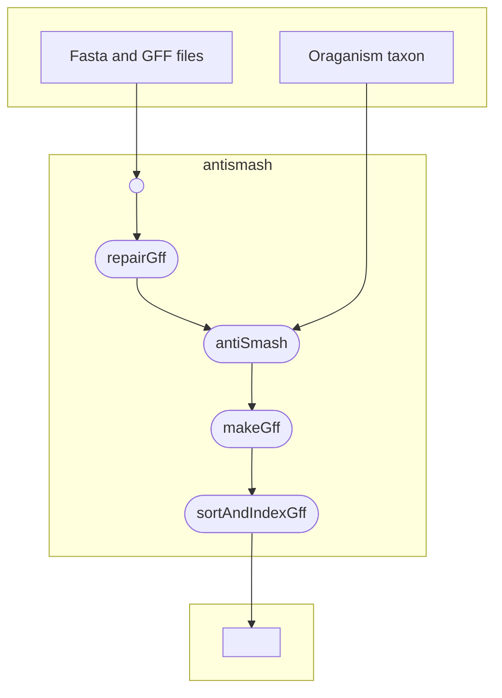

# antismash-nextflow
This workflow uses [antiSMASH](https://antismash.secondarymetabolites.org/#!/about) to identify and annoate secondary metabolites biosynthesis gene clusters from fungal genomes in the VEuPathDB database. More details on the antiSMASH can be found [here](https://academic.oup.com/nar/article/51/W1/W46/7151336?login=true)
It takes as input the oragnisms fasta files and GFF files specified in a csv file and the organism taxon. 

**
Get Started
**
To run the workflow the following dependencies need to be installed

* Docker
> `https://docs.docker.com/engine/install/`
* Nextflow
> `curl https://get.nextflow.io | bash`

* The pull the git hub repo using the following command
> `git pull https://github.com/VEuPathDB/antismash-nextflow.git`

* Alternatively the workflow can be run directly using nextflow which pull down the repo. 
> `nextflow run VEuPathDB/antismash-nextflow -with-trace -c  <config_file> -r main`

 

**
Input Data
**
Example of the input can be found in the `data` directoty. The following files are required to run the workflow.
* Fasta files of the organisms to be analyszd
* GFF files of the organisms to be analyzed (`See example in the data folder`)
* A CSV file with there columns in the format [SampleName,SampleName.gff,SampleName.fasta] (`See input.csv in the data directory`)
* The nextflow.config `see example in the parent directory`

**
Ouput Results
**
Example of outputs can be found in the Results folder. For a sample (genome) analyzed the following files are generated.
* A sorted zipped GFF files of the containing annotation of where identified secondary metabolites mapped to the genomes `See example in Results directory under GFF`
* An index file of the sorted GFF file `See example in Results directory under GFF`

***
Nextflow workflow diagram
*** 
